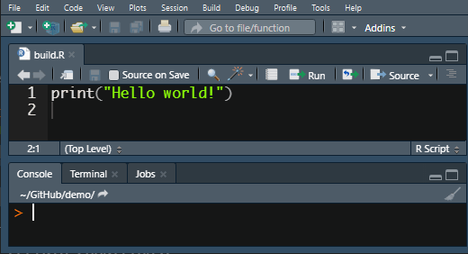

<!-- README.md is generated from README.Rmd. Please edit that file -->

```{r, include = FALSE}
knitr::opts_chunk$set(
  collapse = TRUE,
  comment = "#>",
  fig.path = "man/figures/README-",
  out.width = "100%"
)
```

# buildr  
Comfort way to run build scripts

<!-- badges: start -->
[](https://github.com/netique/buildr/actions?query=workflow%3AR-CMD-check)
[](https://CRAN.R-project.org/package=buildr)

[](https://www.tidyverse.org/lifecycle/#maturing)

<!-- badges: end -->

WARNING: UNDER CONSTRUCTION!

<!-- Working with reproducible reports or any other similar projects often requires to run the script that "builds" the output file in a specified way. One can become tired from repeatedly switching to the build script and sourcing it. -->
<!-- The `buildr` package does this one simple thing via "RStudio addin" – user can set up the *keyboard shortcut* and run the build script with **one keystroke anywhere anytime.** The second way is to pass `buildr()` (don't forget the parentheses!) command to console which does the same thing. Both ways source the `build.R` (case *insensitive*) file present in the current working directory. -->

## Installation

You can install the stable version of `buildr` from [CRAN](https://CRAN.R-project.org/package=buildr) with:

``` r
install.packages("buildr")
```

And the development version from [GitHub](https://github.com/netique/buildr) with:

``` r
if (!require(rsdemotes)) {install.packages("remotes")}
remotes::install_github("netique/buildr")
```
## Basic usage

This is a basic example which shows you how to solve a common problem:

```{r example}
library(buildr)
## basic example code
```

However, much more feasible is to use RStudio's addins and create [keyboard shorcut](http://rstudio.github.io/rstudioaddins/#keyboard-shorcuts) (Tools > Modify Keyboard Shorcuts... > *here search for "Buildr"*):

<!--  -->

## License
This program is free software and you can redistribute it and or modify it under the terms of the [GNU GPL 3](https://www.gnu.org/licenses/gpl-3.0.en.html).
