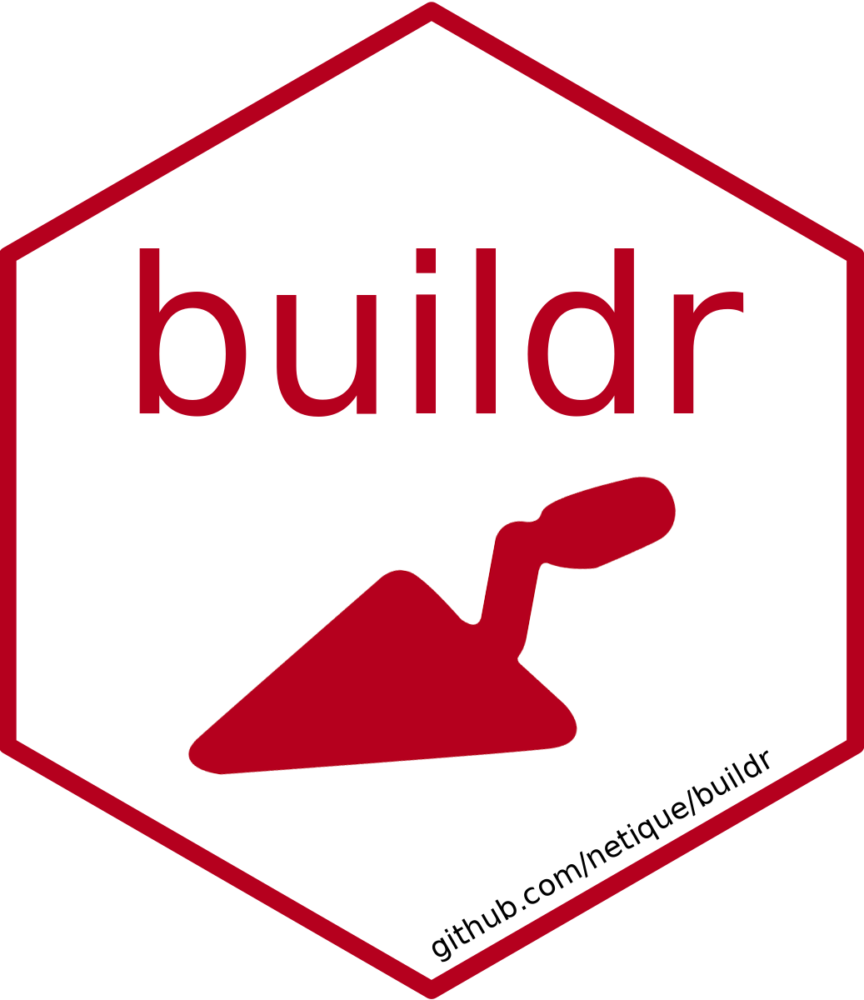

# Buildr  
Easy way to run build scripts


[](https://CRAN.R-project.org/package=buildr)


## Overview
Working with reproducible reports or any other similar projects often requires to run the script that 'builds' the output file in a specified way. One can become tired from repeatedly switching to the build script and sourcing it.
The `buildr` package does this one simple thing via 'RStudio addin' – user can set up the *keyboard shortcut* and run the build script with **one keystroke anywhere anytime.** The second way is to pass `buildr()` (don't forget the parentheses!) command to console which does the same thing. Both ways source the `build.R` (case *insensitive*) file present in the current working directory.

## Installation
The easiest way to get `buildr` is to install it from CRAN:
```
install.packages("buildr")
```

Or you can get the newest development version from GitHub:
```
if (!require(remotes)) {install.packages("remotes")}
remotes::install_github("netique/buildr")
```
## Version
Current version available on [**CRAN**](https://CRAN.R-project.org/package=buildr) is 0.0.3. 
The newest development version available on [**GitHub**](https://github.com/netique/buildr) is 0.0.3.<br>

## Usage
It's very easy to use `buildr`:
```
library(buildr)
buildr()
```

## License
This program is free software and you can redistribute it and or modify it under the terms of the [GNU GPL 3](https://www.gnu.org/licenses/gpl-3.0.en.html).
