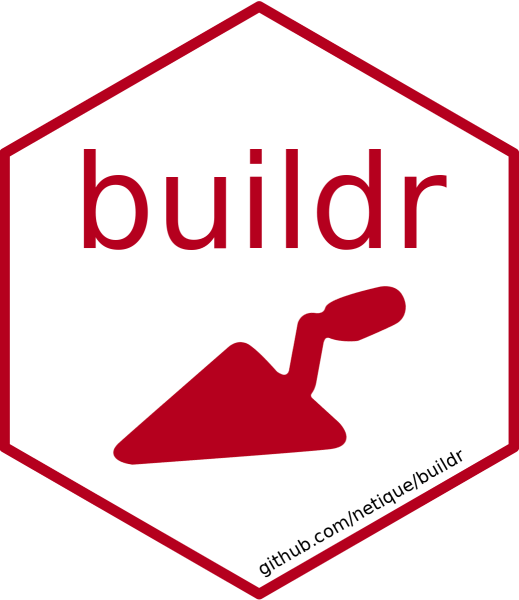

<!-- README.md is generated from README.Rmd. Please edit that file -->

# buildr 

<!-- badges: start -->

[](https://CRAN.R-project.org/package=buildr)
[](https://netique.r-universe.dev)
[](https://github.com/netique/buildr)
[](https://github.com/netique/buildr/actions?query=workflow%3AR-CMD-check)
[](https://cranlogs.r-pkg.org/)
[](https://lifecycle.r-lib.org/articles/stages.html#maturing/)

<!-- badges: end -->

> Organize & Run Build Scripts Comfortably

<!-- Warning! This development version is under construction, use the stable CRAN release, or install this development release with caution. Everything should work as intended if you see the green  badge. Basic documentation is provided as well. -->

Working with reproducible reports or any other similar projects often
requires to run the script that “builds” the output file in a specified
way. `{buildr}` can help you organize, modify and comfortably run those
scripts. The package provides a set of functions that **interactively
guides you through the process** and that are available as [RStudio
Addin](https://rstudio.github.io/rstudioaddins/), meaning you can set up
the **keyboard shortcuts**, enabling you to choose and run the desired
build script with **one keystroke anywhere anytime.**

## Installation

You can install the stable version of `{buildr}`
([](https://CRAN.R-project.org/package=buildr))
from [CRAN](https://CRAN.R-project.org/package=buildr) with:

``` r
install.packages("buildr")
```

And the development version ([](https://github.com/netique/buildr))
from [GitHub](https://github.com/netique/buildr) with:

``` r
if (!require(remotes)) {install.packages("remotes")}
remotes::install_github("netique/buildr")
```

## Load the package

First, load the package with:

``` r
library(buildr)
```

You can skip the step above and prepend `buildr::` to every function
call. That could be handy if you use `{buildr}` functions only
occasionally.

## Use `{buildr}` in three steps

1.  First, call `init()`, which initializes a special `Makefile` in
    project root with automatically discovered build scripts that share
    a common prefix and separator (“build” and “\_“, by default).
    `Makefile` is a standard”recipe book” which tells the software how
    it should be compiled. It’s so general it can serve perfectly for
    our purposes. See the [documentation for GNU
    Make](https://www.gnu.org/software/make/manual/html_node/) or read
    `vignette("know_your_buildr")` vignette of `{buildr}`.

2.  If you have only one build script, you may just proceed by calling
    `build()`. However, **the strength of `{buildr}` lies in the ease
    with which you can choose the desired script and run it when your
    project is populated with many of them**. To do so, call `aim()` and
    choose among the scripts `{buildr}` discovered for you. `aim()` will
    set one of the `Makefile` targets to be recognized by RStudio Build
    pane.

3.  The last step that you’ll need and use most of the time is the
    actual “building”. Simply call `build()` to run the first `Makefile`
    entry that you have previously set with `aim()`.

That’s it! To learn more about `{buildr}`, `Makefile`s or other relevant
stuff, please refer yourself to the `vignette("know_your_buildr")`
vignette, which describes how to use `{buildr}` as an Addin, **how to
define your keyboard shortcut** and much more.

Happy building!

## License

This program is free software and you can redistribute it and or modify
it under the terms of the [GNU GPL
3](https://www.gnu.org/licenses/gpl-3.0.en.html).
