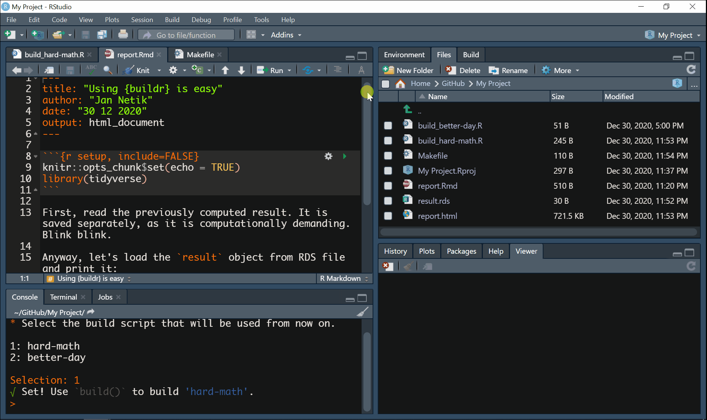

```{r, include = FALSE}
knitr::opts_chunk$set(
  echo = FALSE,
  collapse = TRUE,
  comment = "#>",
  out.width = "100%"
)
```

This vignette extends what `README` or `{buildr}` homepage already briefly described. After reading it, you'll be familiar with:

* how to work with `{buildr}` using your own keyboard shortcuts
* how `{buildr}` works under the hood
* what is a `Makefile` and how `{buildr}` uses it
* some advanced usage

## `{buildr}` + RStudio = ❤️

It's easy to work with `{buildr}` by printing function calls in your `R` console. However, much more feasible is to use `{buildr}` as RStudio Addin, which plays nicely with keyboard shortcuts, adding to the comfort. `{buildr}` addin commands are available below your toolbar in RStudio just upon the installation:

```{r addinsShowcase}

```

> Well, that's pretty neat, but my time is precious and I don't mean to spend it by clicking around that tiny toolbar.

Likewise! Here comes the keyboard shortcuts. The quickest way how to set them up is to use `buildr::edit_shortcuts()` as shown here (for `build()` addin command):

```{r shortcutsShowcase}
knitr::include_graphics("shortcuts_showcase.gif")
```

Note that all three functions are supported as addin commands. If you stick with recommended defaults, there is no need to use anything else. The only function that may need a richer user input is `init()`. Let's describe it in more detail.

## Let's see what you got there

The `init()` function should be called first (and only occasionally afterwards). It searches your project root (directory where your `.Rproj` file resides) and looks for `.R` scripts that shares a common prefix separated from the rest of a file name by a separator ("build" and "_" by default, respectively). Although it is possible to use different prefix and separator, we recommend that you stick with the default. For more details, please see the reference (documentation) for the `init()` function.

Those "build scripts" can do really anything, that's up to you. Commonly, they share the following:

1. loading of libraries
2. sourcing some `.R` scripts, e.g., `source("run_this.R", encoding = "UTF-8", local = TRUE)` this could be:
  * downloading any remote data
  * cleaning them
  * estimating "heavier" models, saving their output 
3. finally, some `{rmarkdown}` call, say `rmarkdown::render("my_report.Rmd")`

Here is `init()` in action:

```{r}
knitr::include_graphics("init_showcase.gif")
```

## Line up your bricks

Once the `{buildr}` discovered your build scripts, it automatically creates a `Makefile` in your project root for you and populates it with rules describing how to run your build scripts. Let's talk about `Makefile`s more (**you can skip this section if you just want to use the package and do your stuff**).

`Makefile`s have a long history and are very useful in software development (see the [full ocumentation for GNU Make](https://www.gnu.org/software/make/manual/html_node/)). They are powerful enough that they can instruct complicated compilers on how to build an application or even an operating system, and running your build script is nothing to them. They typically consist of so-called "rules" which comprises of target and its recipe (in uttermost simplicity):

```
target:
  recipe
```

A target is usually a file name, but in our case, it is arbitrary string uniquely identifying given `Makefile` rule. A recipe consist of a command describing what to do. In our case, we want to source a `.R` script, say `build_all.R`, so our rule would look like this:

```
all:
  @Rscript -e 'source("build_all.R")'
```

The target of our rule is "all" and the recipe instructs the computer to quietly (hence the `@`) start `R` and source the script "build_all.R", which resides in your project root. Note that `Makefile`s are whitespace sensitive. A tab must always precede the beginning of the recipe. **Again, you don't have to bother with any of this, as the `{buildr}` does everything for you.**

Now you may wonder why this section is called "Line up your bricks"? That's simple. The purpose of `aim()` is to line up the `Makefile` rules in a particular order, because the Rstudio Build pane always takes the first rule available (in fact, you can specify the target manually, but it is buried deep inside the GUI). The goal of `aim()` is to list your `Makefile` rules and show them so that you can pick the one you are interested in (i.e. to prioritize it). Your choice then projects in the actual `Makefile` -- the desired rule is in the first place. That's what `aim()` does. In case you already know the target of given rule, you can just supply it directly in the call like this: `aim(target = "all")` or even simpler `aim("all")`.

Here is `aim()` in action:

```{r}
knitr::include_graphics("aim_showcase.gif")
```

## Build

Now that everything is set-up, your only task is to call `build()`. Under the hood, `{buildr}` makes sure that RStudio is set appropriately to handle the `Makefile`. RStudio Build pane may be set for building packages or websites, so it is crucial to ensure your script is run nice and clean. In case something is wrong, `{buildr}` automatically offers you a remedy.

Here is `build()` in action:

```{r}

```

## What's next?

If you looked in the documentation of the package, you may wonder what is the purpose of `command_args` argument. When the build script is processed in RStudio Build pane, the recipe may be accompanied by command argument. This argument can be picked up by `R` and used in your build script to further specify how it should be run. In order to use it, state your command argument when you initialize the `Makefile` using `init()` or manually. Note that the command argument will be placed after *each* rule's recipe. Then, include the following line to your script:

```
command_args <- commandArgs(trailingOnly = TRUE)

```

The object `command_args` that you created by the assignment now comprises the command argument stated in `Makefile` and you can further use it inside your script. E.g., you can query whether specific command argument was passed by `if ("my_arg" %in% command_args) {print("Yes")} else {print("No")}`.

And as always, happy building!
